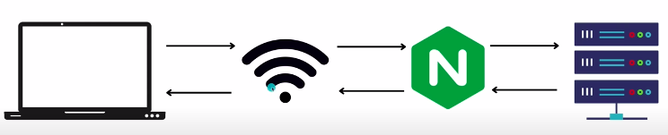

## Studies

### TSL 

https://www.hostinger.com.br/tutoriais/o-que-e-ssl-tls-https?ppc_campaign=google_search_generic_hosting_all&bidkw=defaultkeyword&lo=1001773&gclid=CjwKCAjw0ZiiBhBKEiwA4PT9zzl0j3O5NRIetMk6Xwia11MmRIuyO2TAj4CBSTxDHHpRFgWfN8NyBRoCUU4QAvD_BwE

https://www.gta.ufrj.br/grad/06_1/ssl/func_tls.htm


# 42_school_Inception

<div align="justify">
This project aims to broaden your knowlege of system administration by using Docker.
 
 

<br>

---

 


---

<div>

<br>

##  What is Docker? 
---


<div align="justify">
Docker is a platform that enables developers to easily create, deploy, and run applications in a containerized environment. Containers are lightweight, portable, and self-contained environments that contain all the necessary dependencies and configuration files to run an application.

Docker allows developers to package an application and its dependencies into a single container, which can then be deployed on any platform that supports Docker. This makes it easier to move applications between different environments, from development to testing to production, without the need for manual configuration or installation of dependencies.

Docker also provides a centralized repository called Docker Hub, where developers can share and download pre-built Docker images for popular applications and frameworks. This helps to reduce the time and effort required to set up a development environment, as developers can simply download the necessary Docker images and start building their application immediately.
</div>


 

<br>

## Docker vs Virtual Machine
---


<br>

## Docker Install in Linux OS Using the Repository
---

1.  Became Sudo in  Debian

	- Login as root - ``` su```

	- Install sudo - ```apt install sudo```

	- Add user - ```/sbin/adduser <user> sudo```

2. Switch user

	- su - < user >

3. Update apt
	
	- ```sudo apt update ```
	- ```sudo apt-get update ```

4. Install packages to allow ```apt``` to use the repository over HTTPS

	- ```sudo apt install apt-transport-https ca-certificates curl gnupg lsb-release```

5. Add Docker's official GPG key

	- ```wget https://download.docker.com/linux/debian/gpg```
	- ```sudo apt-key add pgpg```

6. Set up the Docker Repository

	- ```echo "deb [arch=amd64] https://download.docker.com/linux/debian $(lsb_release -cs) stable" | sudo tee /etc/apt/sources.list.d/docker.list```
	- ```sudo apt update ```
	- ```sudo apt-get update ```

7. Install Docker Engine, containerd and Docker Compose

	- ```sudo apt-get install docker-ce docker-ce-cli containerd.io docker-buildx-plugin docker-compose-plugin```

8. Check Docker Runing Status

	- ```sudo systemctl status docker```

9. Add user to Docker group (not using sudo to run docker)

	- ```sudo usermod -aG docker $USER```

<br>

## Install Docker Desktop (not using a Linux OS)
---

Follow the instructions to install Docker Desktop

- [Install Docker Desktop Instructions](https://www.docker.com/products/docker-desktop/)

<br>

## Docker Commands

- [Docker Commands Link](https://docs.docker.com/engine/reference/commandline/docker/)

<br>


## Docker Compose
---


<br>

## Docker Images
---


<br>

### Pull Docker Image from Docker Hub
---

```docker pull <imagename>:<tag>```

<br>

### Create a Docker Image
---


<br>

## Links
---

[Docker Tutorial](https://www.youtube.com/watch?v=3c-iBn73dDE)


<br>

## Port Bindind
---

The binding port between the container and the hosting computer is made during the run comand

- ``` docker run -p <localhost port> : <container port> <image name>```


<br>


### Links
---

[Docker Install Using the Repository](https://docs.docker.com/engine/install/debian/)

[How to Install Docker on Debian 11 Bullseye](https://www.youtube.com/watch?v=NiINMxfLXSw&t=40s)

[Switch user](https://www.youtube.com/watch?v=_jUxsbmKGV8)

[Add user to docker group](https://www.youtube.com/watch?v=VjUbSe8ONhs)

<br>

##  What is Wordpress?

---

<div align="justify">
WordPress is a popular open-source content management system (CMS) that allows users to easily create and manage websites, blogs, and online stores. It was first released in 2003 and has since become the most widely used CMS, powering over 40% of all websites on the internet.

WordPress provides users with a user-friendly interface and a wide range of customization options, making it easy for anyone to create a website without needing to know how to code. It also has a vast ecosystem of plugins and themes, which can be used to extend the functionality of a website or change its design.

WordPress is written in PHP and uses a MySQL database to store content. It can be installed on any web server that supports PHP and MySQL, making it a versatile platform that can be used by businesses, bloggers, and developers alike.
</div>

<div align="justify">

## Install and Configure WordPress
***

1. Up date your websystem

	- ```sudo apt update```  
	- ```sudo apt-get update```


### Links

[Install and Configure WordPress](https://www.youtube.com/watch?v=pOESHd1G-HI)


</div>
<br>

<div align="justify">

> ***DOMAIN NAME*** - It's what people type in the web browser to get into your web site.

> ***HOSTING*** - It's were your files or data for you website are stored.  
When someone goes to your website, the files that make up your website have to be accessed from another computer somewhre else in the world.  
The company that has the computer with your website files on, it's called a hosting provider.

> 

</div>

<br>

## What is PHP
---

<div align="justify">
O PHP (um acrônimo recursivo para PHP: Hypertext Preprocessor) é uma linguagem de script open source de uso geral, muito utilizada, e especialmente adequada para o desenvolvimento web e que pode ser embutida dentro do HTML.

```
<!DOCTYPE html>
<html>
<head>
<title>Exemplo</title>
</head>
<body>

<?php
    echo "Olá, eu sou um script PHP!";
?>

</body>
</html>
```
Em vez de muitos comandos para mostrar HTML (como acontece com C ou Perl), as páginas PHP contém HTML em código mesclado que faz "alguma coisa" (neste caso, mostra "Olá, eu sou um script PHP!"). O código PHP é delimitado pelas instruções de processamento (tags) de início e fim <?php e ?> que permitem que você entre e saia do "modo PHP".

O que distingue o PHP de algo como o JavaScript no lado do cliente é que o código é executado no servidor, gerando o HTML que é então enviado para o navegador. O navegador recebe os resultados da execução desse script, mas não sabe qual era o código fonte. Você pode inclusive configurar seu servidor web para processar todos os seus arquivos HTML com o PHP, e então não há como os usuários dizerem o que você tem na sua manga.
Existem três áreas principais onde os scripts PHP são usados:

- Scripts no lado do servidor (server-side).
- Scripts de linha de comando.
- Escrever aplicações desktop.

O PHP trabalha tanto como módulo quanto como um processador CGI.
</div>

<br>

##  What is NGINX?
---

<div align="justify">
NGINX is open source software for:

<br>

- ### WEB SERVING (serve web content to the browser)
<br>

- ### Proxy Server for email (IMAP, POP3 and SMTP)

<br>

- ### Reverse Proxying (HTTP, TCP and UDP servers)
<br>




<br>

- ### Caching


<br>

- ### Load Balancing for Escaling Aplications (HTTP, TCP and UDP servers)
<br>


<br>

- ### Media Streaming

- ### Encripting

- ### and more...


<br>

Because it can handle a high volume of connections, NGINX is commonly used as a reverse proxy and load balancer to manage incoming traffic and distribute it to slower upstream servers – anything from legacy database servers to microservices.  
NGINX also is frequently placed between clients and a second web server, to serve as an SSL/TLS terminator or web accelerator. Acting as an intermediary, NGINX efficiently handles tasks that might slow down your web server, such as negotiating SSL/TLS or compressing and caching content to improve performance. Dynamic sites, built using anything from Node.js to PHP, commonly deploy NGINX as a content cache and reverse proxy to reduce load on application servers and make the most effective use of the underlying hardware.

### Studies
---

> Directives - a key value pair

>Context - blocks of code with directives

<br>

### Serving a Static Content
---


### NGINX Docker Image
---

- Install nginx
- Install ssl
- Create ssl certificate
- Create a nginx.conf file

#### **Dockerfile**

>```FROM alpine:3.16```  
``` ```  
``` ```  

## Links
---

[NGINX Crash Course](https://www.youtube.com/watch?v=7VAI73roXaY)

[ssl configuration](https://phoenixnap.com/kb/generate-openssl-certificate-signing-request)

</div>

<br>

### Redis
---

A memory space cache for database content. Makes the access of most viewed
content faster than requisitions to the database. Requires a space of memory
into the host.

<br>


### FTP (File TRansfer Protocol)
---

- Protocolo para transferência de arquivos entre dois hosts (um cliente e um servidor).
- Esta definido na RFC 959.
- Protocolo da camada de aplicação TCP/IP - suporta compartilhamento de arquivos em redes TCP/IP e mais antigas.
- Utiliza conexões de dado e controle separadamente. Os dados são transferidos pela porta 20, e a porta 21 transmite informações de controle.
- Clientes podem se autenticar por meio de usuário senha, ou conexão anônima (se o servidor permitir)
- É possível proteger o nome de usuário e senha usando SSL/TLS, na forma de FTPS, ou usando SFTP(SSH File Transfer Protocol).

#### Modos de Conexão

O modo de conexão determina como a conexão de dados é estabelecida.
O cliente cria uma conexão TCP a partir de uma porta aleatória com a porta 21 do servidor FTP.
O FTP pode operar de dois modos: Ativo ou Passivo.

#### Ativo

- O cliente escuta conexões de dados que chegam do servidor em uma porta informada.
- O servidor inicia um canal de dados a partir de sua porta 20.
- Problemática se o cliente estiver atrás de um firewall ou roteador NAT.

#### Passivo

- O cliente usa a conexão de controle para enviar um comando PASV ao servidor e recebe um endereçoIP e número de porta aleatório como resposta, que serão usados para iniciar um canal de dados a partir de outra porta açeatória no cliente.
- Usada geralmente quando o cliente não consegue receber conexões TCP de entrada, por exemplo por conta de um firewall na rede.

#### Modos de Representação de Dados

Na transferência, os dados podem ser representados principalmente como:

- ASCII- Usado para texto.
- Binário (Imagem) - Para arquivos em geral.
	No modo binário, os dados são transmitidos byte por byte.

Exitem outros modos como o EBCDIC e Local.

#### Modos de Transferência de Dados

- STREAM - Dados enviados em um fluxo contínuo. Todos processamento é realizado pelo TCP.
- BLOCK - Dados são divididos em vários blocos pelo FTP, e então repassados ao TCP para transmissão.
- COMPRIMIDO - Dados são comprimidos usando algum algoritimo. 

#### FTP Anônimo

- Um servidor pode oferecer o serviço de FTP Anônimo, no qual os usuários se loguem com uma conta anonymous, sem o emprego de senha- o servidor muitas vezes pede o e-mail do usuário como "senha". Porém, nenhuma verificação é realizada.
- No geral, é empregada por servidores que armazenam atualizações de softwares para os clientes baxarem.

#### Security

- The FTP was not created to be a secure protocol, and it is apt t osuffer a lots of attacks, like brutal force, packages capturing, spoofing, and others.
- FTP do not encrypt the transmited data, including names and passwords.
- The encrypt problem can be solved using the safe version of FTP, like FTPS, or can be transmited by a SSH tunel or VPN (most commum).

#### FTP CLients

A FTP client is a software that connects to a server to require file transfer, as dwnload or upload.

The FTP client can be a command line or a graphic application (or web).

## Links
---
What is FTP https://www.youtube.com/watch?v=C_EE0qoREUM

FTP with WORDPRESS https://www.youtube.com/watch?v=TyqwwAzwLuM

<br>
